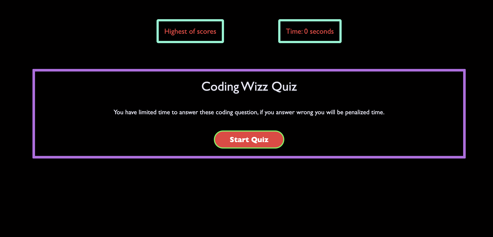

1.Taking a code quiz

2. Click the start button

3. A timer starts and I am presented with a question
**I answer a question**
**I am presented with another question**
**I answer a question incorrectly**
**Time is subtracted from the clock**
**All questions are answered or the timer reaches 0
The game is over
I can save my initials and score

Will utilize Html, Javascript, and CSS

Repository
https://github.com/coleyrockin/Codewizzquiz

Deployed Application
https://coleyrockin.github.io/Codewizzquiz/

